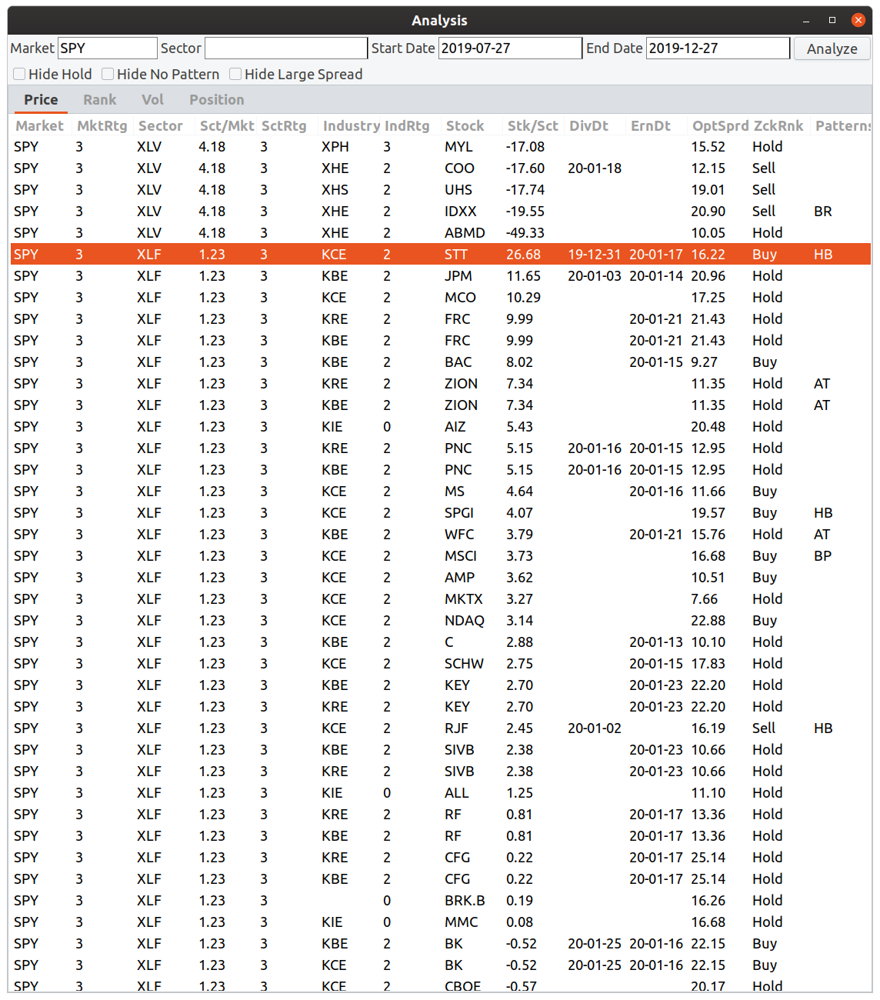
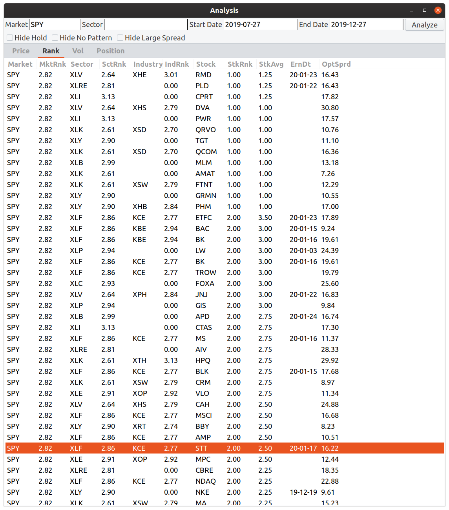
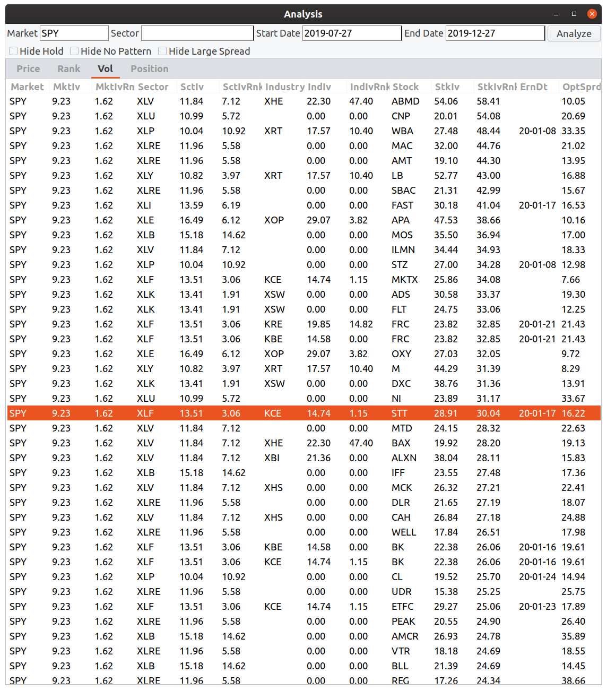
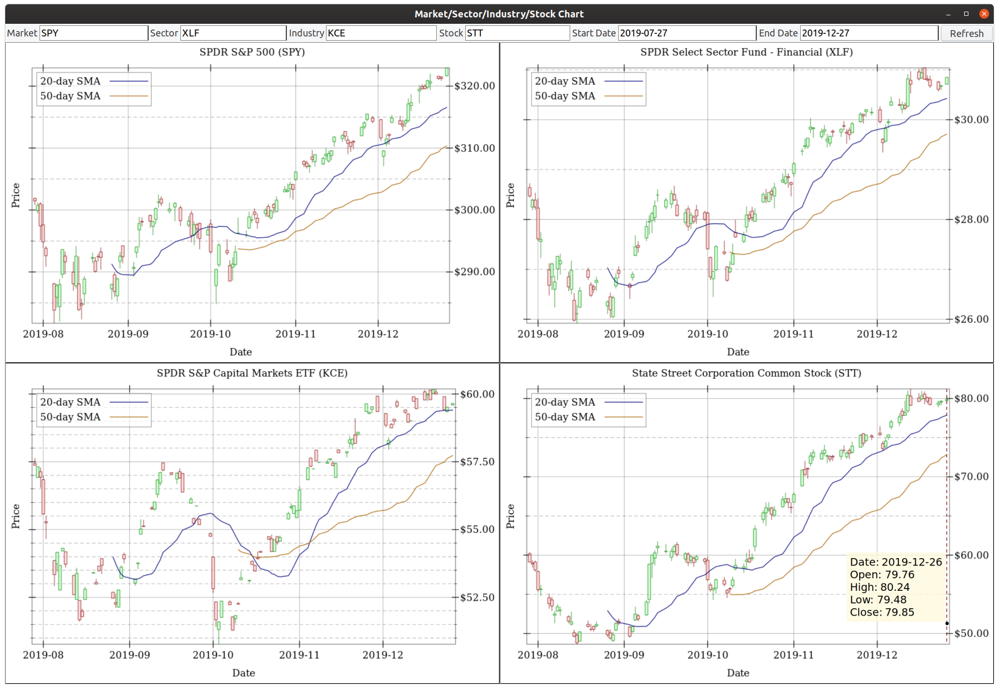
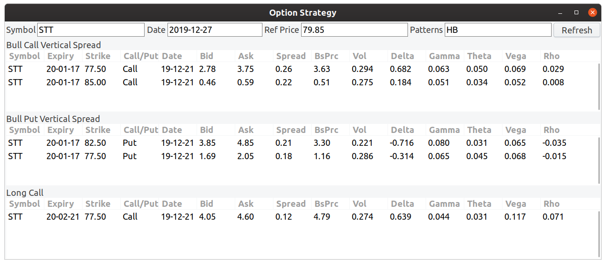
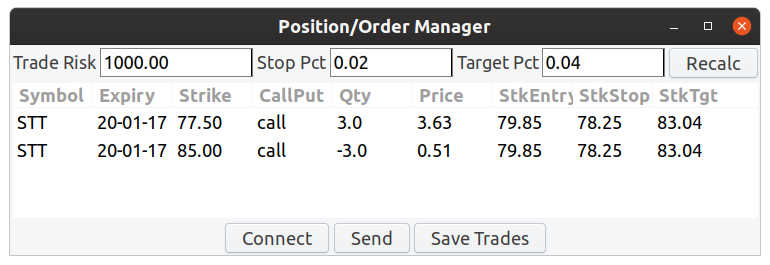

# renegade-way

This Racket application does the following:
* Analyzes stocks based on technicals, analyst ratings, and volatility
* Displays charts showing the stock and its market, sector, and industry
* Provides option strategies to use for entering positions on the stock
* Sends option strategy orders to Interactive Brokers for execution
 
Here is a sample image of price analysis:


We see:
* Market, Sector, Industry, Stock. These are the SPDR ETFs in which a particular stock is a component
* MktRtg (Market Rating), SctRtg (Sector Rating), IndRtg (Industry Rating). These simple score range from -3 to +3 and
  reflect the relationship of the current price to 20-day and 50-day moving averages
* Sct/Mkt (Sector vs Market), Stk/Sct (Stock vs Sector). This is the price percentage performance difference over the start-date and end-date period.
* DivDt. Upcoming estimated dividend. This is computed by taking a dividend from last year + one month and adding a year. It is rarely precise.
* ErnDt. Upcoming earnings announcement date.
* OptSprd. Average spread of select options having a bid.
* ZckRnk. Current analyst rank of the stock
* Patterns. This includes bull pullback, bear rally, high base, low base, ascending triangle, descending triangle, range rally, and range pullback.
  They are abbreviated in the list.

By selecting one of these entries, we will see the corresponding chart loaded as well as the option strategy updated when a pattern is available.

Here is a sample image of rank analysis:


We can see the current analyst rank of the stock, ranging from 1 (Strong Buy) to 5 (Strong Sell), as well as the previous 4-week average. This lets us
be aware of recent, significant upgrades. Ranks 1 and 2 will send an increasing rank (IR) and ranks 4 and 5 will send a decreasing rank (DR) pattern
to Option Strategy.

Here is a sample image of volatility analysis:


We can see implied volatilities as well as implied volatility rank based on the 52-week high and low of vol. Entries with upcoming earnings dates
will send an increasing vol (IV) pattern to Option Strategy; entries without upcoming earnings dates default to decreasing vol (DV).

Here is a sample image of a chart:


Moving your mouse over the chart will display the open, high, low, and close values for a particular candle.

Here is a sample image of an option strategy:


In addition to being linked to the selection made in Analysis, you can also input a pattern here if you think the analysis missed something.

Here is a sample image of an order manager:


You can do the following here:
* Fill in order amounts based on accepted trade risk
* Connect to the locally running IBKR TWS instance
* Send the prepared order
* Save all trades from the past week

The intended way to launch this application is by doing the following:

```bash
$ racket main.rkt -u db-username -n db-name -p db-password
```

`db-username` defaults to 'user' and `db-name` defaults to local, so those arguments can be omitted if they match your database.
`db-password` must be provided.

You will need to either use data from these projects or provide a database schema that mirrors the schema provided by:
* [ecnet-earnings-calendar](https://github.com/evdubs/ecnet-earnings-calendar)
* [iex-stocks](https://github.com/evdubs/iex-stocks)
* [nasdaq-symbols](https://github.com/evdubs/nasdaq-symbols)
* [oic-options-chains](https://github.com/evdubs/oic-options-chains)
* [spdr-etf-components](https://github.com/evdubs/spdr-etf-components)
* [yahoo-dividends-splits](https://github.com/evdubs/yahoo-dividends-splits)

Requires Racket 7.0 or greater.
